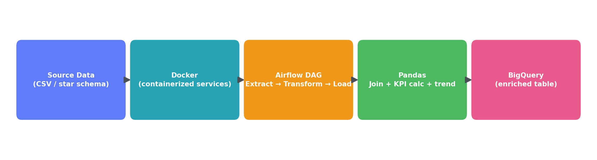

# LTE KPI Pipeline — Docker + Airflow + BigQuery

An orchestrated ETL pipeline that ingests daily LTE network KPI data, joins it against a star-schema dimensional model, computes performance metrics and trend indicators, and loads the enriched result into Google BigQuery.



## Overview

This project takes a common telecom RAN monitoring workflow — daily RRC (Radio Resource Control) success rate tracking across cell sites — and re-platforms it onto a modern, containerized data stack. It mirrors the structure of a production pipeline: containerized orchestration, dependency-managed tasks, a dimensional data model, and a cloud data warehouse as the serving layer.

**Stack:** Docker · Apache Airflow 3.3 · Python (Pandas) · Google BigQuery

## Data Model

The source data is a star schema:

- **`network_kpi_daily`** (fact table) — one row per site per day: `rrc_attempts`, `rrc_completions`
- **`sites`** (dimension) — site metadata, foreign keys to vendor and market
- **`vendors`** (dimension) — network equipment vendor
- **`markets`** (dimension) — geographic market / region

```
vendors ─┐
         ├─→ sites ─→ network_kpi_daily
markets ─┘
```

## Pipeline (DAG: `lte_kpi_pipeline`)

| Task | What it does |
|---|---|
| `extract` | Reads the four source CSVs (fact + 3 dimensions) |
| `transform` | Joins sites → vendors → markets onto the KPI fact table; computes RRC success rate (`completions / attempts`); flags sites below a 98% threshold; calculates a 7-day rolling average per site for trend detection |
| `load` | Loads the enriched, denormalized table into BigQuery (`WRITE_TRUNCATE`) |

This denormalize-for-serving pattern is standard practice: keep the warehouse normalized for storage/integrity, materialize a wide flat table for BI/reporting consumption.

## Why this project

Built to demonstrate applied skill in the modern data-engineering stack (containerization, orchestration, cloud warehousing) grounded in real domain expertise from 20+ years in telecom network engineering — the KPI logic (RRC success rate, threshold-based exception detection, rolling trend analysis) mirrors real-world RAN performance monitoring.

## Running it

1. `docker compose up -d` — brings up Airflow (scheduler, worker, triggerer, apiserver), Postgres, and Redis
2. Place the CSVs in `dags/data/`
3. Trigger `lte_kpi_pipeline` from the Airflow UI (`localhost:8080`)
4. Query the result in BigQuery: `airflow_demo.lte_kpi_enriched`

## Project structure

```
.
├── dags/
│   └── lte_kpi_pipeline.py     # Airflow DAG definition
├── data/
│   ├── vendors.csv
│   ├── markets.csv
│   ├── sites.csv
│   └── network_kpi_daily.csv
└── assets/
    └── architecture_diagram.png
```

## Related work

Part of a broader portfolio of telecom network analytics projects:
- [Multi-Vendor LTE Configuration Compliance Analytics Platform](https://github.com/mgrigor/MultiVendor-Compliance-Analytics)
- [LTE Performance ETL & Trending Analytics Platform](https://github.com/mgrigor/LTE-Performance-ETL-Trending-Analytics)
